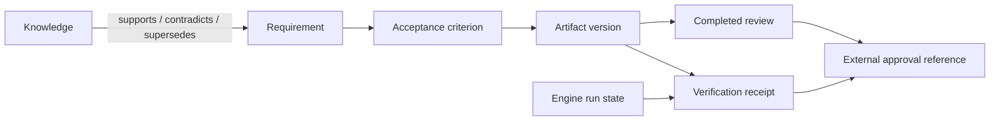

# Execution state and evidence graphs

The engine owns `.loop/lifecycle/<run_id>.json`: attempts, absolute deadline, process ownership,
terminal state and verification receipt IDs. Resume validates the original configuration and target
before starting a new verification. `.loop/runs/*.jsonl` remains observation telemetry and cannot
grant approval or reset a deadline. See [loop lifecycle](loop-fix.md).

Evidence lives in separate immutable files under `.loop/evidence/`. Each JSON record has a kind,
UUID, schema version and content hash. Verification records bind the exact command, emitted verdict,
root, before/after workspace identity and run attempt. State files link to their receipt ID.



Edges are stored on the dependent record: `depends_on` points to its prerequisites. `supports`,
`contradicts` and `supersedes` describe knowledge relationships. Contradiction/supersession invalidates
the older evidence and dependent records; artifact edits or incomplete reviews also invalidate the
chain. `check` verifies the current local content and reports reasons, never an authorization grant.
No graph database or external service is required (consistent with ADR-0001).

```bash
evidence.mjs artifact plan.md
evidence.mjs record review-record.json
evidence.mjs read <receipt-id>
evidence.mjs check <receipt-id>
```

Imported records can represent requirements, ACs, artifacts, reviews, external approval references
or knowledge. `record` refuses imported verification receipts; `verdict-run.sh` produces those.
Lesson verification seals are also reserved for the validated `lessons.mjs` producer and cannot
be imported as ordinary knowledge records.
A review uses `status: complete` only after the actual required reviewers complete. An approval
reference includes `actor`, `action`, `external_reference`, and exact artifact dependencies. It records
an existing decision. The host's permission system and the user's authorized scope still control
merge, deployment and sending. A local record cannot manufacture that permission.

The CLI deliberately provides a small storage/validation contract. Workflow-specific mappings
(which ACs are required, which reviewers are required, which external actor can approve) belong to
the workflow adapter. An arbitrary fresh `true` verifier is still inadequate evidence if the workflow
does not bind the right behavior and command. Retain final required gates; reuse focused evidence
only when its scope and artifact version still match.

Trust boundary: hashes detect accidental edits and mismatched artifacts; they are not cryptographic
attestations against an unrestricted writer who can recompute hashes. Runtime hooks protect these
files as operational guardrails. Stronger hostile-writer isolation requires a separate verifier
identity or external attestation service and is outside this local plugin's claimed boundary.
